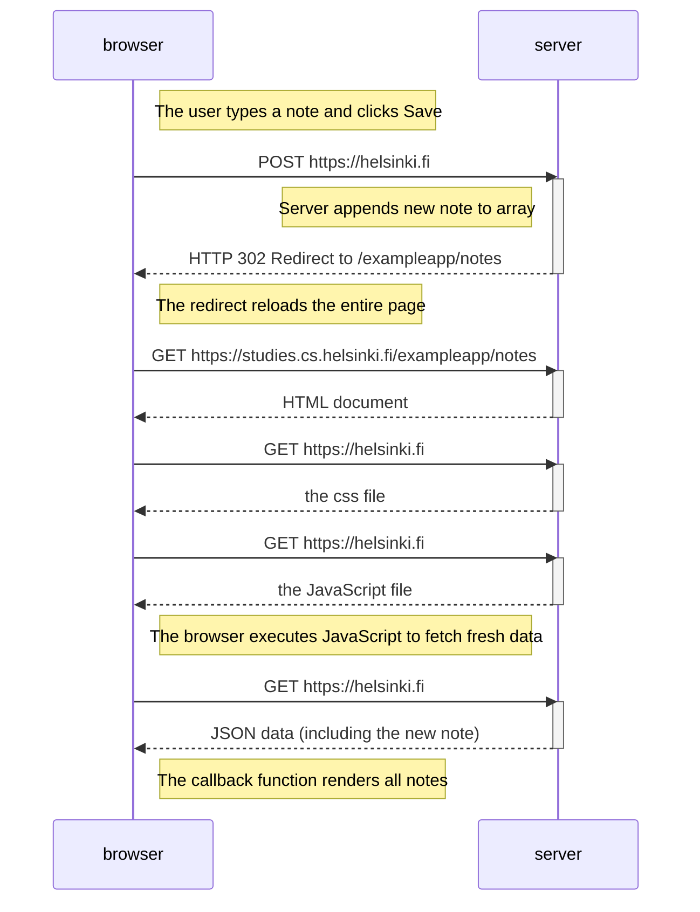
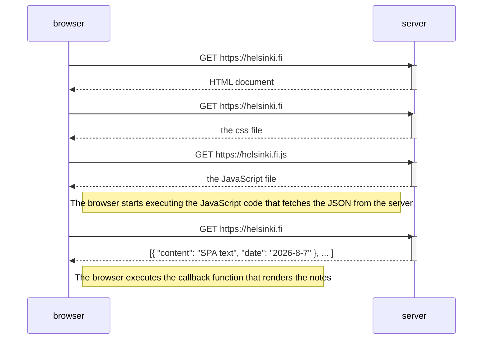
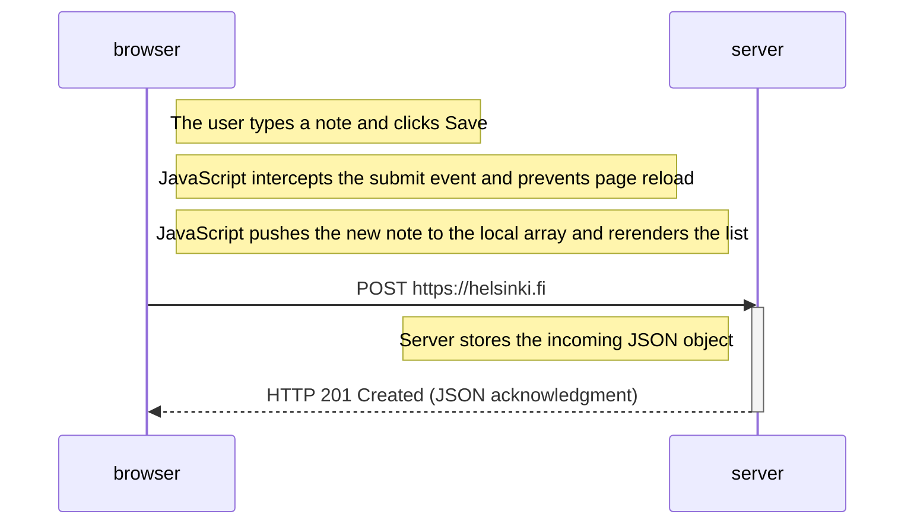

## Exercise 0.4: New note diagram

```mermaid
sequenceDiagram
    participant browser
    participant server

    Note right of browser: The user types a note and clicks Save

    browser->>server: POST https://helsinki.fi
    activate server
    Note left of server: Server appends new note to array
    server-->>browser: HTTP 302 Redirect to /exampleapp/notes
    deactivate server

    Note right of browser: The redirect reloads the entire page

    browser->>server: GET https://studies.cs.helsinki.fi/exampleapp/notes
    activate server
    server-->>browser: HTML document
    deactivate server

    browser->>server: GET https://helsinki.fi
    activate server
    server-->>browser: the css file
    deactivate server

    browser->>server: GET https://helsinki.fi
    activate server
    server-->>browser: the JavaScript file
    deactivate server

    Note right of browser: The browser executes JavaScript to fetch fresh data

    browser->>server: GET https://helsinki.fi
    activate server
    server-->>browser: JSON data (including the new note)
    deactivate server

    Note right of browser: The callback function renders all notes
```

## Exercise 0.5: Single Page Application Diagram

```mermaid
sequenceDiagram
    participant browser
    participant server

    browser->>server: GET https://helsinki.fi
    activate server
    server-->>browser: HTML document
    deactivate server

    browser->>server: GET https://helsinki.fi
    activate server
    server-->>browser: the css file
    deactivate server

    browser->>server: GET https://helsinki.fi.js
    activate server
    server-->>browser: the JavaScript file
    deactivate server

    Note right of browser: The browser starts executing the JavaScript code that fetches the JSON from the server

    browser->>server: GET https://helsinki.fi
    activate server
    server-->>browser: [{ "content": "SPA text", "date": "2026-8-7" }, ... ]
    deactivate server

    Note right of browser: The browser executes the callback function that renders the notes
```

## Exercise 0.6: New Note in Single Page Application Diagram

```mermaid
sequenceDiagram
    participant browser
    participant server

    Note right of browser: The user types a note and clicks Save
    Note right of browser: JavaScript intercepts the submit event and prevents page reload
    Note right of browser: JavaScript pushes the new note to the local array and rerenders the list

    browser->>server: POST https://helsinki.fi
    activate server
    Note left of server: Server stores the incoming JSON object
    server-->>browser: HTTP 201 Created (JSON acknowledgment)
    deactivate server
```