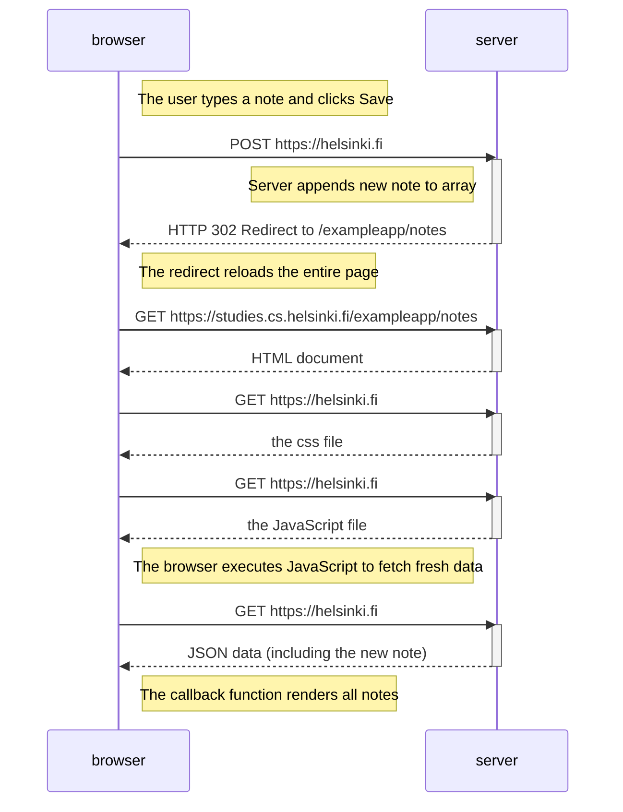

```mermaid
sequenceDiagram
    participant browser
    participant server

    Note right of browser: The user types a note and clicks Save

    browser->>server: POST https://helsinki.fi
    activate server
    Note left of server: Server appends new note to array
    server-->>browser: HTTP 302 Redirect to /exampleapp/notes
    deactivate server

    Note right of browser: The redirect reloads the entire page

    browser->>server: GET https://studies.cs.helsinki.fi/exampleapp/notes
    activate server
    server-->>browser: HTML document
    deactivate server

    browser->>server: GET https://helsinki.fi
    activate server
    server-->>browser: the css file
    deactivate server

    browser->>server: GET https://helsinki.fi
    activate server
    server-->>browser: the JavaScript file
    deactivate server

    Note right of browser: The browser executes JavaScript to fetch fresh data

    browser->>server: GET https://helsinki.fi
    activate server
    server-->>browser: JSON data (including the new note)
    deactivate server

    Note right of browser: The callback function renders all notes
```